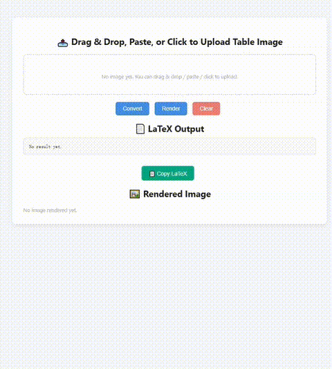

# 🧮 Table2LaTeX Tool

A lightweight, offline-friendly tool that turns table images into LaTeX code — with one-click rendering preview.

This project is designed as a **plug-and-play web UI** for table recognition. It comes with built-in support for the [GeoGPT-Table2LaTeX](https://huggingface.co/JasonKitty/geogpt-table2latex) model — a fine-tuned InternVL2-1B specialized for academic tables — but **can be easily adapted** to other models by modifying [`model.py`](./model.py).

Use this tool for quick testing, demo sharing, or local deployment without external APIs or servers.

<p align="left">
  
</p>

---

## 🌐 Live Demo (Run Locally)

### 🖥️ What it does

- 📸 Upload/paste/drag table images
- 🔁 Converts image into LaTeX code
- 🖼️ Renders the LaTeX output into preview image using XeLaTeX
- ✅ Copy, rerun, or clear in one click

---

## 🚀 Quick Start

### 1. Clone this repository

```bash
git clone https://github.com/JasonKitty/table2latex_web
cd table2latex_web
```

### 2. Prepare your environment

> ✅ Requires a working GPU environment with CUDA & `transformers` properly installed.

```bash
pip install -r requirements.txt
```

You also need to install LaTeX and poppler for rendering support:

```bash
sudo apt-get update && sudo apt-get install -y \
    texlive-full \
    poppler-utils \
    libgl1 \
    curl
```

### 3. Download Model Weights

By default, this tool uses the [GeoGPT-Table2LaTeX weights](https://huggingface.co/JasonKitty/geogpt-table2latex-weights). (to be open-sourced soon)
To use them:

```bash
git lfs install
git clone https://huggingface.co/JasonKitty/geogpt-table2latex-weights weights
```

The folder structure should look like:

```
weights/
└── InternVL2-1B-finetuned-table-v5/
    ├── model.safetensors
    ├── config.json
    └── ...
```

---

### 4. Launch the Web UI

```bash
python app.py
```

Then visit [http://localhost:8396](http://localhost:8396) in your browser.

---

## 🔧 Custom Model Support

You can replace the default model with your own by modifying the [`model.py`](./model.py) file.  
Just change the `image_to_latex()` implementation to load your model and generate output from an input `PIL.Image`.

---

## 📁 File Structure

```
.
├── app.py                    # Flask app
├── model.py                  # Model interface (edit to use custom models)
├── requirements.txt          # Python dependencies
├── Dockerfile                # Optional: containerized deployment
├── static/render/            # Rendered image output
├── templates/index.html      # Web UI layout
└── weights/                  # Pretrained weights (default: GeoGPT)
```

---

## 📜 License

This project is MIT licensed.
